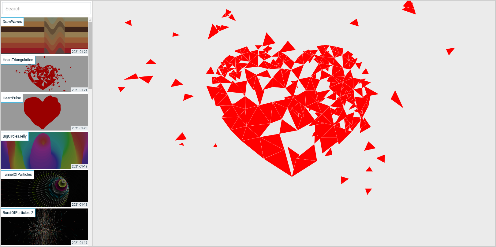

## canvas
I try to add one animation every day.  
**Plans:** some animation with WebGL, Three.js, GLSL, SVG, D3, GSAP

[**DEMO**](https://canvas-every-day.web.app/) — checked in the latest chrome version.

`16-02-2021` - I have started to post all new animation on CodePen as well.

### Dependencies:
- [`canvas-sketch`](https://github.com/mattdesl/canvas-sketch) 
- [`canvas-sketch-util`](https://github.com/mattdesl/canvas-sketch-util) 
- [`react`](https://github.com/facebook/react) 
- [`create-react-app`](https://github.com/facebook/create-react-app) 
- [`react-notifications-component`](https://github.com/teodosii/react-notifications-component) 
- [`nice-color-palettes`](https://github.com/Jam3/nice-color-palettes) 
- [`classnames`](https://github.com/JedWatson/classnames) 
- [`dat.gui`](https://github.com/dataarts/dat.gui) 
- [`react-virtualized`](https://github.com/bvaughn/react-virtualized) 
- [`gsap`](https://github.com/greensock/GSAP) 
- [`d3`](https://github.com/d3/d3) 

### Useful YouTube channels:
- [`Franks laboratory`](https://www.youtube.com/c/Frankslaboratory/videos) 
- [`The Art of Code`](https://www.youtube.com/c/TheArtofCodeIsCool/videos) 
- [`Coding Math`](https://www.youtube.com/user/codingmath/videos) 
- [`Yuri Artyukh`](https://www.youtube.com/user/flintyara/videos) 
- [`Chris Courses`](https://www.youtube.com/c/ChrisCourses/videos) 

### Useful courses:
- [`https://frontendmasters.com/courses/canvas-webgl/`](https://frontendmasters.com/courses/canvas-webgl/) 
- [`https://frontendmasters.com/courses/webgl-shaders/`](https://frontendmasters.com/courses/webgl-shaders/) 

### Documentations, websites, guides:
- [`Three.js Doc`](https://threejs.org/docs/index.html#manual/en/introduction/Creating-a-scene) 
- [`Three.js Fundamentals`](https://threejsfundamentals.org/) 
- [`WebGL Fundamentals`](https://webglfundamentals.org/) 
- [`WebGL2 Fundamentals`](https://webgl2fundamentals.org/) 
- [`WebGL guide`](https://xem.github.io/articles/webgl-guide.html) 
- [`http://three-demos.glitch.me/`](http://three-demos.glitch.me/) 
- [`Canvas Technical Guide`](https://docs.unrealengine.com/udk/Three/CanvasTechnicalGuide.html) 
- [`https://www.khronos.org/opengl/wiki`](https://www.khronos.org/opengl/wiki) 
- [`https://www.shaderific.com/glsl`](https://www.shaderific.com/glsl) 
- [`The Book of Shaders`](https://thebookofshaders.com/) 
- [`https://www.kirupa.com/canvas/index.htm`](https://www.kirupa.com/canvas/index.htm) 
- [`WebGL, GLSL guide + examples`](https://webglsamples.org/google-io/2011/index.html) 
- [`https://www.shadertoy.com/`](https://www.shadertoy.com/) 
- [`Math geometry`](https://mathsisfun.com/geometry/unit-circle.html) 

### Images, textures
- [`Solar textures`](https://www.solarsystemscope.com/textures/) 
- [`Free PBR`](https://freepbr.com/) 
- [`google equirectangular images`](https://www.google.com/search?q=equirectangular+images&tbm=isch&ved=2ahUKEwialqrCyIDuAhUI_hoKHRZvC2gQ2-cCegQIABAA&oq=equirectangular+images&gs_lcp=CgNpbWcQA1CsbFjsbWC9b2gAcAB4AIAB9QKIAfUCkgEDMy0xmAEAoAEBqgELZ3dzLXdpei1pbWfAAQE&sclient=img&ei=KSTyX9rdH4j8a5bercAG&bih=1276&biw=2560#imgrc=Nlw8VvEHmTpjNM) 

### Tools
- [`Gifmaker`](https://gifmaker.me/) 

### Extensions
- [`FPS extension | Chrome`](https://chrome.google.com/webstore/detail/fps-extension/gdkkmimldhefhmmmlalioafomdlahcog) 
- [`FPS | Firefox`](https://addons.mozilla.org/en-US/firefox/addon/archi-fps-meter/?src=recommended) 

